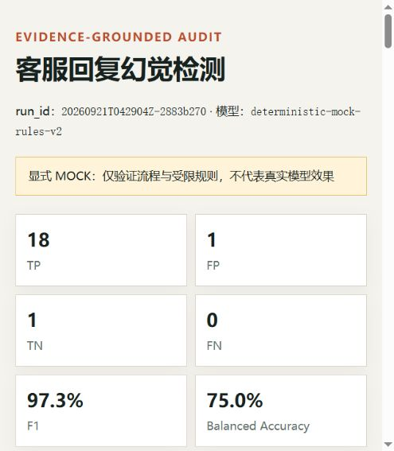

# 客服回复幻觉检测

> 对客服回复逐项抽取可核验断言，与当前知识库核对证据，再用独立评估入口计算检出率。

本项目完成招聘任务要求的 20 条批量检测。最终提交版本使用显式 `mock-rules-v2` 确定性规则：20/20 条成功处理，人工正例检出 18/18，误报 `h16`，无漏报。

> 这里的 `mock` 是题目允许的受限实现，不是 LLM 实测。它证明检测、证据校验、故障隔离、评估和报告链路可运行，不证明真实模型效果或新数据泛化能力。

## 1. 幻觉分类定义

判断时先区分证据关系，再标注问题类型和业务严重度，避免把“知识库没有写”误判为“事实已经证伪”。

| 幻觉类型 | 定义与边界 | 默认严重度 |
|---|---|---|
| 事实矛盾 | 同一主体、属性和条件下，回复与知识库明确冲突 | `medium`；权益、地址、关键参数可升 `high` |
| 无依据断言 | 回复给出确定事实，但知识库无法支持；不代表现实中必然为假 | `medium`；权益、承诺可升 `high` |
| 能力或操作虚构 | 声称已经查询、修改、退款或升级，但知识库明确表示系统无此能力 | `high` |
| 关键条件遗漏／过度概括 | 漏掉会改变用户决策的适用条件，或把条件事实说成绝对事实 | `medium`；重大影响可升 `high` |
| 安全限制被否定 | 把明确的安全限制改成无条件安全承诺 | `critical` |

- 证据关系：`supported / contradicted / unsupported / uncertain`。
- 严重度：`none / low / medium / high / critical`。
- 一般省略、礼貌话术和合理同义改写不算幻觉。
- `unsupported` 表示当前知识库缺少依据；`contradicted` 才表示已有明确反证。

完整聚合规则见 [SPEC.md](SPEC.md)，分类配置见 [configs/taxonomy.json](configs/taxonomy.json)。

## 2. 检测方法

```text
客服问题 + 系统回复 + 当前知识库
              ↓
      单条隔离、逐项抽取断言
              ↓
  主体 / 属性 / 数值 / 条件 / 能力核对
              ↓
  引文校验 + 类型与严重度聚合
              ↓
     预测先落盘，再读取人工标签评估
```

| 环节 | 实现 |
|---|---|
| 检测隔离 | 检测入口只读取 `id / user_question / system_reply / knowledge_base`，不读取 ground truth |
| 断言核对 | 覆盖数字、单位、时限、地址、属性、肯否、操作完成、承诺和必要条件 |
| 证据约束 | 回复引文必须来自当前回复；矛盾证据必须来自当前知识库；无依据断言不得伪造引文 |
| 结构化输出 | Pydantic 校验状态、真假、类型、严重度、理由和证据 |
| 故障处理 | 单条失败输出 `error / null`，不把 API 或格式故障冒充正常 |
| 独立评估 | 保存预测后再按 ID 关联人工标签，计算混淆矩阵、覆盖率和不平衡基线 |

`mock-rules-v2` 使用通用关系规则，不包含样本 ID 分支、整段回复查表或人工标签解释。真实 OpenAI-compatible provider 已实现，但本次最终结果没有使用真实模型。

## 3. 检出率

评估集共 20 条：人工正例 18 条、负例 2 条。选定运行 `20260921T042904Z-2883b270`，20 条状态均为 `ok`。

| 模式 | TP | FP | TN | FN | Precision | Recall | F1 | Accuracy | 正常回复误报率 | Balanced Accuracy |
|---|---:|---:|---:|---:|---:|---:|---:|---:|---:|---:|
| `mock-rules-v2` | 18 | 1 | 1 | 0 | 94.7% | 100.0% | 97.3% | 95.0% | 50.0% | 75.0% |
| 全报幻觉基线 | 18 | 2 | 0 | 0 | 90.0% | 100.0% | 94.7% | 90.0% | 100.0% | 50.0% |

- 人工正例检出：18/18，漏报为 0。
- 误报：`h16`。回复中的“商品图片都是实物拍摄”缺少直接证据，规则按无依据确定断言报警；人工标签按核心色差说明一致判为正常。
- 首轮 `mock-rules-v1` 曾漏检 `h07`；修订原因和规则变化保留在 [CHANGELOG.md](CHANGELOG.md)，没有覆盖失败历史。
- 数据不是盲测且负例只有 2 条，因此不能只用 95% Accuracy 或 100% Recall 宣称效果优秀。

详细误判与边界案例见 [docs/evaluation.md](docs/evaluation.md)。



## 4. AI 工具使用情况

| 用途 | 实际使用 | 人工／程序复核 |
|---|---|---|
| 开发辅助 | OpenAI Codex 桌面 Agent 用于读取需求、设计数据合同、编写代码、测试和文档 | 通过真实命令运行测试并检查 Git diff |
| 运行时检测 | 最终 20 条结果来自显式 `mock-rules-v2` 确定性规则 | 人工标签只进入独立评估入口，不进入规则判断 |
| 结果核对 | AI 辅助定位误报、漏报和边界案例 | 程序复算 ID 集合、混淆矩阵与指标；人工复核 `h16`、`h07` |
| 未使用 | 未用生成式 AI 伪造运行截图；未把 mock 指标写成 LLM 指标；未提交密钥或招聘原始附件 | `.env`、运行目录和原始材料均不进入 Git |

更完整记录见 [docs/ai-usage.md](docs/ai-usage.md)。

## 5. 快速运行

要求 Python 3.11+ 和 [uv](https://docs.astral.sh/uv/)。

```powershell
git clone https://github.com/Accessiiing/customer-reply-audit.git
cd customer-reply-audit
uv sync --extra dev

# 运行测试
uv run pytest

# 使用仓库内脱敏样例完成检测 → 评估 → HTML 报告
uv run reply-audit run `
  --input data/examples/replies.json `
  --truth data/examples/ground_truth.json `
  --mode mock
```

对招聘附件全量运行时，把两个样例路径替换为本地 `task4_replies.json` 与 `task4_ground_truth.json`。每次运行会创建独立的 `artifacts/runs/<run_id>/`，不会覆盖历史结果。

## 6. 各文件索引

| 文件／目录 | 职责 |
|---|---|
| [README.md](README.md) | 招聘方第一入口：分类、方法、指标、AI 使用和运行方式 |
| [SPEC.md](SPEC.md) | 检测边界、聚合规则、证据合同和评估合同 |
| [CHANGELOG.md](CHANGELOG.md) | 规则迭代、失败轨迹和修订原因 |
| [configs/taxonomy.json](configs/taxonomy.json) | 幻觉类型、证据关系和严重度配置 |
| [prompts/detect-v1.md](prompts/detect-v1.md) | 真实 API 模式的检测提示词 |
| [`src/customer_reply_audit/`](src/customer_reply_audit/) | CLI、检测、规则、Provider、评估和 HTML 报告实现 |
| [`tests/`](tests/) | schema、检测隔离、指标、规则与报告测试 |
| [`data/examples/`](data/examples/) | 可提交、可复现的脱敏最小样例 |
| [docs/evaluation.md](docs/evaluation.md) | 20 条结果、误报、边界案例和基线分析 |
| [docs/ai-usage.md](docs/ai-usage.md) | 开发 AI、运行时检测与人工复核的职责边界 |
| [docs/screenshots/mock-report.png](docs/screenshots/mock-report.png) | 真实本地 HTML 运行结果截图 |
| [docs/status.md](docs/status.md) | 当前发布状态和复现证据 |
| [`docs/decisions/`](docs/decisions/) | 按时间保存的项目决策记录 |

## 7. 已知限制

- 当前检出率来自已知 20 条数据和确定性 mock，不能写成真实 LLM 效果。
- 负例只有 2 条，正常回复误报率 50%；需要更多正常样本才能估计泛化表现。
- “引文存在”只证明没有伪造引文，不证明语义判断必然正确。
- 本工具是离线审计，不包含发送前拦截或线上反馈闭环，不能声称已经降低线上幻觉发生率。
- 招聘原始附件保持只读且不进入公开仓库。
